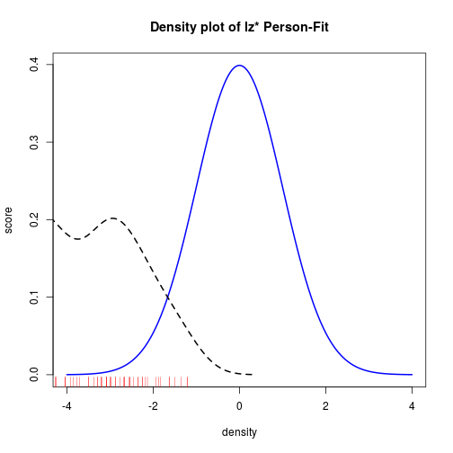
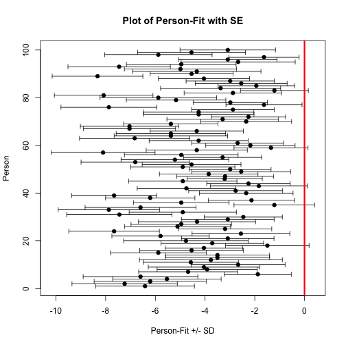

<!--
%\VignetteEngine{knitr::knitr}
%\VignetteIndexEntry{Getting started with Person-Fit in PP}
-->
# Getting started with Person-Fit functions

A brief introduction in the currently implemented person fit functions will be added soon. Currently the **LZ, LZ*** and also the **Infit-Outfit-Statistics** are implemented. We also added the Infit-Outfit-Functions for the Partial-Credit Model. Meanwhile we are working on plots for a better understanding of the person misfit as well as on inference statistic methods.


```r
knitr::opts_chunk$set(message = FALSE, results='hide')
```

Now a simple example will be given.
First, we will simulate some data for our hands on example:

```r
library(PP)

set.seed(1337)

# simulate some intercepts
diffpar <- seq(-3,3,length=15)
# simulate some slope parameters
sl     <- round(runif(15,0.5,1.5),2)
la     <- round(runif(15,0,0.25),2)
ua     <- round(runif(15,0.8,1),2)

# simulate response matrix
awm <- matrix(sample(0:1,100*15,replace=TRUE),ncol=15)
```

We will start with a simple 1PL-Model. First, we have to estimate the person parameters. Here we have to choose an estimation method. It is important, that you can choose **mle, wle or map** only for the LZ and LZ* Index. For the Infit-Outfit statistic we support **mle and wle** estimates.


```r
# MLE
res1plmle <- PP_4pl(respm = awm,thres = diffpar,type = "mle")
# WLE
res1plwle <- PP_4pl(respm = awm,thres = diffpar,type = "wle")
# MAP estimation
res1plmap <- PP_4pl(respm = awm,thres = diffpar,type = "map")
```

```
## Warning in PP_4pl(respm = awm, thres = diffpar, type = "map"): all mu's are set to 0!
```

```
## Warning in PP_4pl(respm = awm, thres = diffpar, type = "map"): all sigma2's are set to 1!
```

We also support the 2PL, 3PL and 4PL Model:

```r
# ------------------------------------------------------------------------
## 2PL model ##### 
# ------------------------------------------------------------------------
# MLE
res2plmle <- PP_4pl(respm = awm,thres = diffpar, slopes = sl,type = "mle")
# WLE
res2plwle <- PP_4pl(respm = awm,thres = diffpar, slopes = sl,type = "wle")

# ------------------------------------------------------------------------
## 3PL model ##### 
# ------------------------------------------------------------------------
# MLE
res3plmle <- PP_4pl(respm = awm,thres = diffpar,
                    slopes = sl,lowerA = la,type = "mle")
# WLE
res3plwle <- PP_4pl(respm = awm,thres = diffpar,
                    slopes = sl,lowerA = la,type = "wle")
# ------------------------------------------------------------------------
## 4PL model ##### 
# ------------------------------------------------------------------------
# MLE
res4plmle <- PP_4pl(respm = awm,thres = diffpar,
                    slopes = sl,lowerA = la,upperA=ua,type = "mle")
# WLE
res4plwle <- PP_4pl(respm = awm,thres = diffpar,
                    slopes = sl,lowerA = la,upperA=ua,type = "wle")
```

After the estimation of the person parameter we are able to calculate the person fits. At this point you are able to calculate only one kind of personfit as well as all various simultaneously (as shown next).


```r
# ------------------------------------------------------------------------
## 1PL model ##### 
# ------------------------------------------------------------------------
## LZ*-Index ##### 
pfit1pl_lz <- Pfit(respm=awm,pp=res1plwle,fitindices="lzstar")
## LZ*-Index combined with Infit-Outfit ##### 
pfit1pl_li <- Pfit(respm=awm,pp=res1plwle,fitindices=c("lzstar","infit","outfit"))
# ------------------------------------------------------------------------
## 2PL model ##### 
# ------------------------------------------------------------------------
## LZ*-Index ##### 
pfit2pl_lz <- Pfit(respm=awm,pp=res2plwle,fitindices="lzstar")
## LZ*-Index combined with Infit-Outfit ##### 
pfit2pl_li <- Pfit(respm=awm,pp=res2plwle,fitindices=c("lzstar","infit","outfit"))
# ------------------------------------------------------------------------
## 3PL model ##### 
# ------------------------------------------------------------------------
## LZ*-Index ##### 
pfit3pl_lz <- Pfit(respm=awm,pp=res3plwle,fitindices="lzstar")
## LZ*-Index combined with Infit-Outfit ##### 
pfit3pl_li <- Pfit(respm=awm,pp=res3plwle,fitindices=c("lzstar","infit","outfit"))
# ------------------------------------------------------------------------
## 4PL model ##### 
# ------------------------------------------------------------------------
## LZ*-Index ##### 
pfit4pl_lz <- Pfit(respm=awm,pp=res4plwle,fitindices="lzstar")
## LZ*-Index combined with Infit-Outfit ##### 
pfit4pl_li <- Pfit(respm=awm,pp=res4plwle,fitindices=c("lzstar","infit","outfit"))
```

We can also use different person parameter estimates.


```r
# ------------------------------------------------------------------------
## 1PL model ##### 
# ------------------------------------------------------------------------
## LZ*-Index ##### 
## mle ####
pfit1pl_mle_l <- Pfit(respm=awm,pp=res1plmle,fitindices="lzstar")
## wle ####
pfit1pl_wle_l <- Pfit(respm=awm,pp=res1plwle,fitindices="lzstar")
## map ####
pfit1pl_map_l <- Pfit(respm=awm,pp=res1plmap,fitindices="lzstar")
```

If desired you can simply plot the results of the person-fit statistics as shown below.


Example with real data. First we have to load the dataset
data(pp_amt)
Interpretation of Person Fit Hier ein paar angeben und Bezug zur Literatur nehmen!

**Literatur**

- Armstrong, R. D., Stoumbos, Z. G., Kung, M. T. & Shi, M. (2007). On the performance of the lz person-fit statistic.
- De La Torre, J., & Deng, W. (2008). Improving Person-Fit Assessment by Correcting the Ability Estimate and Its Reference Distribution. Journal of Educational Measurement, , 159-177. 
- Drasgow, F., Levine, M. V. & Williams, E. A. (1985) Appropriateness measurement with polychotomous item response models and standardized indices. 67-86.
- Efron, B., & Stein, C. (1981). The jackknife estimate of variance. 586-596.
- Karabatsos, G. (2003) Comparing the Aberrant Response Detection Performance of Thirty-Six Person-Fit Statistics. 277-298. 
- Magis, D., Raiche, G. & Beland, S. (2012) A didactic presentation of Snijders's lz index of person fit with emphasis on response model selection and ability estimation. 57-81. 
- Meijer, R. R. & Sijtsma, K. (2001) Methodology review: Evaluating person fit.107-135. 
- Molenaar, I. W. & Hoijtink, H. (1990) The many null distributions of person fit indices. 75-106. 
- Mousavi, A. & Cui, Y. Evaluate the performance of and of person fit: A simulation study.
- Reise, S. P. (1990). A comparison of item-and person-fit methods of assessing model-data fit in IRT. 127-137. 
- Snijders, T. B. (2001) Asymptotic null distribution of person fit statistics with estimated person parameter. 331-342. 
- Wright, B. D. & Masters, G. N. (1990). Computation of OUTFIT and INFIT Statistics. 3:4, 84-85. 
- Wright, B. D., & Masters, G. N. (1982). MESA Press, 5835 S. Kimbark Avenue, Chicago, IL 60637.

